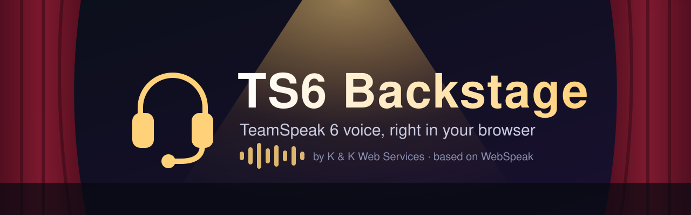

<p align="center">
  
</p>

# TS6 Backstage

**Join a TeamSpeak 6 server straight from your browser — no TeamSpeak client to install.**

TS6 Backstage is a self-hosted web client and voice gateway for TeamSpeak 6 (TeamSpeak 3 works too). Share one link, and your friends can hop into your channels, talk, and chat from any modern browser on desktop or phone.

It's maintained by [K & K Web Services](https://knkws.com) and runs alongside [TS6 Roadie](https://github.com/knkwebservices/ts6-roadie), our music and server-tools bot for TeamSpeak 6. Live on the **TGSC Gaming Community** server.

> **Based on [WebSpeak](https://github.com/EchoSixHIYA/WebSpeak-client-for-TeamSpeak) by EchoSixHIYA.** TS6 Backstage is a modified fork of that project. All credit for the original code goes to its author.

---

## What it does

- **Voice in the browser:** Opus audio, push-to-talk or voice activation, mute, mic test, per-person volume and optional noise suppression
- **Full channel tree:** see who's in each channel and move between channels
- **Chat:** channel, server and private messages, plus pokes and whispers
- **Share audio:** on desktop, share a window or browser tab's sound with your channel
- **Invite links:** create links that expire or can be revoked
- **Admin console:** default server, access rules, sessions, connection history, logs and database backups
- **Optional low-delay voice (WebRTC)** with automatic fallback
- **Screen sharing** with other web users and TeamSpeak 6 clients
- **Skins:** Day, Night (the default here) and ILLUSIA, plus your own `.wskin` skins
- **Mobile-friendly layout** in five languages: English, Deutsch, 中文, Русский and 日本語

---

## Quick start

### Option 1: Docker Compose (Linux)

```bash
git clone --depth 1 https://github.com/knkwebservices/ts6-backstage.git
cd ts6-backstage
docker compose pull
docker compose up -d
```

Open `http://<your-host>:3040`. Data is kept in the `webspeak-data` Docker volume.
This pulls the TS6 Backstage image, `ghcr.io/knkwebservices/ts6-backstage`. To run plain upstream WebSpeak instead, set `WEBSPEAK_IMAGE=ghcr.io/echosixhiya/webspeak:latest`.
Don't run `docker compose down -v`; that deletes the database and admin settings.

### Option 2: Windows or Linux package (no Node.js needed)

1. Download the `windows-x64.zip` or `linux-x64.tar.gz` package from the [releases page](https://github.com/knkwebservices/ts6-backstage/releases/latest). `SHA256SUMS.txt` next to them lets you check the download.
2. Extract it to its own folder.
3. Run `start-backstage.cmd` on Windows or `./start-backstage.sh` on Linux.

### Option 3: From source

Requires Node.js 22.5+, Git, Python, Make and a C/C++ build toolchain.

```bash
npm ci --ignore-scripts
npm run prepare:sdk
npm rebuild @discordjs/opus --foreground-scripts
npm --prefix web ci
npm --prefix web run build
npm run build
npm start
```

---

## First-time setup

1. Go to `http://<your-host>:3040/admin`.
2. Sign in with `admin` / `admin` and **change the password right away** (at least 12 characters). Do this before the page is reachable from the internet: until then, anyone who opens `/admin` first can set it.
3. On the **Servers** page, set your default TeamSpeak server, for example `tgscgo.net#9987`.
4. **Lock it to your server** (only allow the configured server) unless you really want an open gateway. An open gateway lets anyone use your machine to connect to any TeamSpeak server.
5. Put it behind HTTPS before sharing it publicly. Browsers only allow microphone access on secure pages.

### HTTPS with Caddy

```caddyfile
talk.example.com {
    reverse_proxy 127.0.0.1:3040
    header {
        Referrer-Policy strict-origin-when-cross-origin
        Permissions-Policy "microphone=(self), display-capture=(self), camera=()"
        X-Content-Type-Options nosniff
    }
}
```

Optional: allow the admin console only from your own address by adding this inside the site block (put your IP in):

```caddyfile
    @admin_outside {
        path /admin* /api/admin*
        not remote_ip 203.0.113.10
    }
    respond @admin_outside 403
```

### Ports

| Port | What it's for |
| --- | --- |
| `3040/TCP` | Web page and WebSocket (put this behind your HTTPS proxy) |
| `40000–40099/UDP` | Only if you turn on WebRTC low-delay voice |
| `9987/UDP` (outbound) | Connecting to your TeamSpeak server |

### Custom skins

Admins can import `.wskin` skin packages under **Admin → Skins → Import skin package**, then set one as the default. [`docs/examples/tgsc.wskin`](docs/examples/tgsc.wskin) is a dark example with a logo (source in [`docs/examples/tgsc`](docs/examples/tgsc)). A skin can set `"base": "dark"` in its `manifest.json` to build on the Night skin, and can recolor the `--ws-page-bg`, `--ws-surface-1`, `--ws-surface-2`, `--ws-text`, `--ws-text-muted`, `--ws-accent`, `--ws-success`, `--ws-warning`, `--ws-danger` and `--ws-border` color tokens. The full guide is [`docs/SKIN_DEVELOPMENT.md`](docs/SKIN_DEVELOPMENT.md).

### Using it with TS6 Roadie

Every Backstage user reaches TeamSpeak from the gateway's IP address. If Roadie's `ipguard` cog is enabled, exempt that IP so web users aren't flagged as clones or for country/VPN checks.

---

## Requirements and notes

- **Chrome or Edge** (version 94 or newer) are recommended and tested. Firefox works.
- **iPhone and iPad** work (tested in Safari). iOS pauses the microphone and sound while you are on another tab or app, and both come back on their own when you return to the Backstage tab. To stay in voice with the screen off or while using other apps, use the TeamSpeak 6 app instead.
- Push-to-talk only works while the Backstage tab has focus (a browser limit, the same as Discord in a browser). Use voice activation if you want to talk while in a game.
- Up to 100 browser users per instance
- The gateway must be able to reach your TeamSpeak server
- TS6 Backstage is a community project. It is **not** an official TeamSpeak product; TeamSpeak names and trademarks belong to their owners.

---

## Credits and license

- **Original project:** [WebSpeak](https://github.com/EchoSixHIYA/WebSpeak-client-for-TeamSpeak) by [EchoSixHIYA](https://github.com/EchoSixHIYA)
- **TeamSpeak protocol SDK:** [EchoSixHIYA/teamspeak-js](https://github.com/EchoSixHIYA/teamspeak-js)
- **WebRTC:** [werift](https://github.com/shinyoshiaki/werift-webrtc) (MIT)

**Modification notice:** this fork was modified by K & K Web Services beginning October 2026. Changes so far (see [CHANGELOG.md](CHANGELOG.md) and the commit history for every detail):

- 2026-10-03: renamed to TS6 Backstage, new README and banner, page title "TGSC Voice"
- 2026-10-03: removed upstream's QQ, Bilibili, changelog and admin-console header links; the GitHub link points to this fork
- 2026-10-03: the dark (Night) skin is the default for new visitors
- 2026-10-03: the join rate limit uses the visitor's real IP when behind a local reverse proxy
- 2026-10-03: site icon renamed to an ASCII filename
- 2026-10-03: Docker images are published as `ghcr.io/knkwebservices/ts6-backstage`
- 2026-10-04: "Source code" links in the page footer, the settings window and the admin console; release packages attached to this fork's releases; README updates

Licensed under the [GNU Affero General Public License v3.0 only](LICENSE), the same as the original. If you run a modified version of this software for users over a network, you must offer those users the corresponding source code. The full source of TS6 Backstage is available in this repository.
